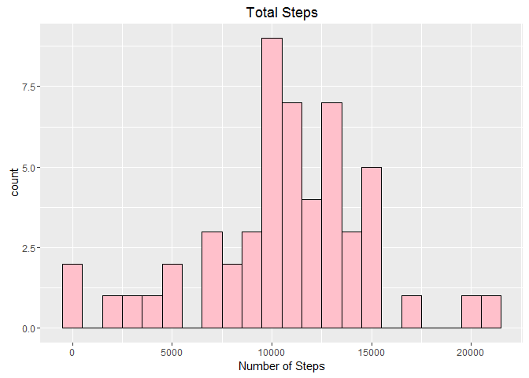

# Reproducible Research: Peer Assessment 1

```r
require(ggplot2)
require(dplyr)
```


## Loading and preprocessing the data

The data that is used in this analysis is contained in the data set "activity.csv"

This analysis makes use of data from a personal activity monitoring device. This device collects data at 5 minute intervals through out the day. The data consists of two months of data from an anonymous individual collected during the months of October and November, 2012 and include the number of steps taken in 5 minute intervals each day.

The original data set contains 17568 observations of 3 variables.

- steps: Number of steps taking in a 5-minute interval (missing values are coded as NA)
- date: The date on which the measurement was taken in YYYY-MM-DD format
- interval: Identifier for the 5-minute interval in which measurement was taken

#### Note that there are a number of days/intervals where there are missing values (coded as NA). These will be REMOVED for the initial analysis


```r
# Read in activity data file
setwd("C:/Users/GreggV/Documents/coursera/Reproducible Research/project 1/RepData_PeerAssessment1")
act_dat <- read.csv("activity.csv")

# remove na's from data set
act_dat2 <- act_dat[complete.cases(act_dat),]
act_dat2 <- tbl_df(act_dat[complete.cases(act_dat),])

#add a column to dataset containing the days of the week
act_dat2$days <- weekdays(as.Date(act_dat2$date, format = "%Y-%m-%d"))
head(act_dat2)
```

```
## Source: local data frame [6 x 4]
## 
##   steps       date interval    days
##   (int)     (fctr)    (int)   (chr)
## 1     0 2012-10-02        0 Tuesday
## 2     0 2012-10-02        5 Tuesday
## 3     0 2012-10-02       10 Tuesday
## 4     0 2012-10-02       15 Tuesday
## 5     0 2012-10-02       20 Tuesday
## 6     0 2012-10-02       25 Tuesday
```

```r
# re-order days of week
act_dat2$days<- factor(act_dat2$days, levels= c("Sunday", "Monday", "Tuesday", "Wednesday", "Thursday", "Friday", "Saturday"))

act_dat2<- act_dat2[order(act_dat2$days),  ]
```


## What is mean total number of steps taken per day?


```r
# calculate mean, median, and total # of steps taken per day

mmt <- group_by(act_dat2, date) %>% summarize(mean = mean(steps), median = median(steps), total = sum(steps))
```

####Histogram of steps taken each day


```r
# Make a histogram of the total number of steps taken each day

day_tot <- (group_by(act_dat2,date) %>% summarize(total = sum(steps)))
day_tot$correction <- "raw data"
gp <- ggplot(day_tot, aes(x = total))
gp + geom_histogram(binwidth = 1000, fill = "pink", color =" black") + ggtitle("Total Steps") +  labs(x="Number of Steps") 
```

 


####The mean number of steps is 10766.2
####The median number of steps is 10765


## What is the average daily activity pattern?

####The plot below displays the average number of steps taken at each 5 minute time interval.
 


####The  time interval containing the maximum average number of steps is 104

## Imputing missing values

Note that there are a number of days/intervals where there are missing values (coded as NA). 
The presence of missing days may introduce bias into some calculations or summaries of the data.


```r
 # Calculate and report the total number of missing values in the dataset (i.e. the total number of rows with NAs)

num_na <- sum(is.na(act_dat$steps))
```

####The original data set contains 2304 missing values.

####The missing values will be replaced by the average number of steps taken on the same day of the week as the missing data.


```r
# The function "fandr" finds "NA's" in data set and replaces them with the avearge number of steps for that day of the week


fandr <- function(data = act_dat){
  
  new_data <- data
  
  dat_sum <- group_by(data,date) %>% summarise(med = median(steps), ave = mean(steps), min = min(steps), max = max(steps), 
                                              total = sum(steps))
  
  dat_sum$day <- weekdays(as.Date(dat_sum$date, format = "%Y-%m-%d"))
  
  #  calculate step averages by day of week
  
  day_ave <- group_by(dat_sum, day) %>% summarize(ave_steps = mean(total/288, na.rm = TRUE))

  #  find NA's and replace with daily average
  
  for(i in 1:nrow(data)){
    
    if(is.na(data[i,1]) == TRUE){
      
      fr <- weekdays(as.Date(new_data$date[i], format = "%Y-%m-%d"))
      
      new_data[i,1] <- day_ave[which(day_ave$day == fr),2]
      
    }
  }
new_data
}
```


```r
dat_imp <- fandr()

#add a column to dataset containing the days of the week
dat_imp$days <- weekdays(as.Date(dat_imp$date, format = "%Y-%m-%d"))

# re-order days of week
dat_imp$days <- factor(dat_imp$days, levels= c("Sunday", "Monday", "Tuesday", "Wednesday", "Thursday", "Friday", "Saturday"))

dat_imp <- dat_imp[order(dat_imp$days),  ]
head(dat_imp)
```

```
##      steps       date interval   days
## 1729     0 2012-10-07        0 Sunday
## 1730     0 2012-10-07        5 Sunday
## 1731     0 2012-10-07       10 Sunday
## 1732     0 2012-10-07       15 Sunday
## 1733     0 2012-10-07       20 Sunday
## 1734     0 2012-10-07       25 Sunday
```


```r
# calculate mean, median, and total # of steps taken per day for imputed data

mmt_imp <- group_by(dat_imp, date) %>% summarize(mean = mean(steps), median = median(steps), total = sum(steps))
head(mmt_imp, n=20)
```

```
## Source: local data frame [20 x 4]
## 
##          date     mean   median     total
##        (fctr)    (dbl)    (dbl)     (dbl)
## 1  2012-10-01 34.63492 34.63492  9974.857
## 2  2012-10-02  0.43750  0.00000   126.000
## 3  2012-10-03 39.41667  0.00000 11352.000
## 4  2012-10-04 42.06944  0.00000 12116.000
## 5  2012-10-05 46.15972  0.00000 13294.000
## 6  2012-10-06 53.54167  0.00000 15420.000
## 7  2012-10-07 38.24653  0.00000 11015.000
## 8  2012-10-08 34.63492 34.63492  9974.857
## 9  2012-10-09 44.48264  0.00000 12811.000
## 10 2012-10-10 34.37500  0.00000  9900.000
## 11 2012-10-11 35.77778  0.00000 10304.000
## 12 2012-10-12 60.35417  0.00000 17382.000
## 13 2012-10-13 43.14583  0.00000 12426.000
## 14 2012-10-14 52.42361  0.00000 15098.000
## 15 2012-10-15 35.20486  0.00000 10139.000
## 16 2012-10-16 52.37500  0.00000 15084.000
## 17 2012-10-17 46.70833  0.00000 13452.000
## 18 2012-10-18 34.91667  0.00000 10056.000
## 19 2012-10-19 41.07292  0.00000 11829.000
## 20 2012-10-20 36.09375  0.00000 10395.000
```
#### The histogram below displays the number of steps each day for the IMPUTED data set


```r
# Make a histogram of the total number of steps taken each day for imputed data

day_tot <- (group_by(dat_imp,date) %>% summarize(total = sum(steps)))
day_tot$correction <- "raw data"
gp <- ggplot(day_tot, aes(x = total))
gp + geom_histogram(binwidth = 1000, fill = "pink", color =" black") + ggtitle("Total Steps(Imputed Data)") +  labs(x="Number of Steps") 
```

 


####The mean number of steps for the imputed data is 10821.2
####The median number of steps for the imputed data is 11015


The following table displays the mean and median total steps for both the raw data (with NA's removed)
and the imputed data using daily means for the missing values.

Var   |Raw Data|Imputed Data
------|--------|----------
mean|10766.2|10765
median|10821.2|11015


```r
# plot histogram

act_dat2$corr <- "raw_data"
dat_imp$corr <- "imputed"
dat_com <- rbind(act_dat2 , dat_imp)
dat_com$corr <- factor(dat_com$corr)

day_tot_com <- group_by(dat_com,corr,date) %>% summarize(total = sum(steps))

 gp <- ggplot(day_tot_com, aes(x = total))
 gp + geom_histogram(aes(fill = corr)) + facet_grid(. ~ corr) + ggtitle("Total Number of Steps Each Day")
```

 


The histogram above allows comparison of the distribution of total steps with the missing values removed vs. replacing the missing values with daily averages.

In the table above, replacing the missing days total steps with the average number of steps for that day of the week made very little differnce in the mean and the median.  However, comparing the two histograms shows a significant increase in the number of steps in the 9000 - 15000 range.  Since there were 8 days that had no data in the original data set, these 8 days have been added back in the imputed data, resulting in the stronger central peak.


## Are there differences in activity patterns between weekdays and weekends?


```r
  # the function "wkdy" add "weekday" or "weekend" to data frame
 
wkdy <- function(data = dat_imp){
  
  for(i in 1:nrow(data)){
    
    if(data$days[i] == "Saturday" | data$days[i] == "Sunday"){
      data$wkdy[i]  = "weekend"
    }
      
     else{
       
       data$wkdy[i]= "weekday"
      
    }
  }
  
  data
}
 
# group data by interval and compute average of steps
 
 dat_imp_day <- wkdy()
 
 dat_imp_int <- group_by(dat_imp_day, wkdy, interval) %>% summarize(mean = mean(steps))
 
gp <- ggplot(dat_imp_int, aes(x = interval, y = mean, color = wkdy))
 gp + geom_line() + facet_grid(wkdy ~ .)  + ggtitle("Average Number of Steps vs. Time")
```

 


The above plots show that the weekdays have a strong peak in the number of steps earlier in the day on weekdays, with significantly lower activity elsewhere.  On weekends, however,  the number of steps is much more consistent over the active period(s) of the day.  It looks like John DOe sleeps in a little on weekesnds, as well. :)
